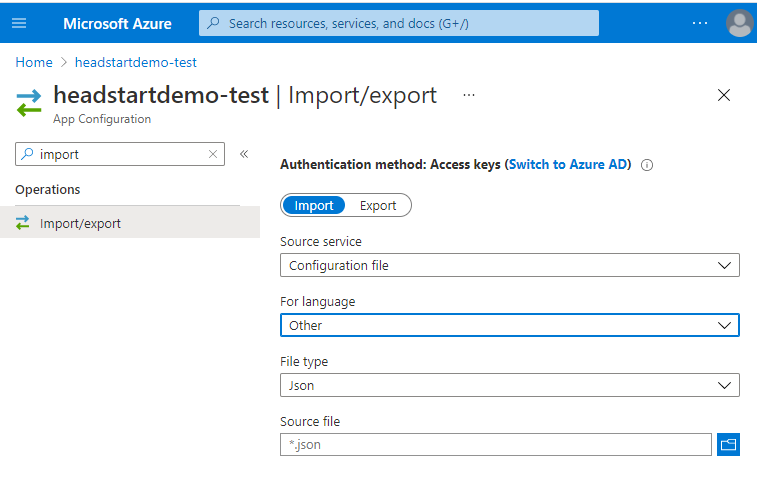

# Headstart

Welcome! The purpose of this project is to give you and your business a "headstart" to building an e-commerce solution on OrderCloud. This is a complete and opinionated solution including three main parts:

1. [Middleware](./src/Middleware/README.md) - The backend written in ASP.NET Core. Extends and enhances the capabilities of OrderCloud by integrating with best-of-breed services.
2. [Buyer](./src/UI/Buyer/README.md) - The frontend buyer application written in Angular. This includes the entire shopping experience from the perspective of a buyer user.
3. [Seller](./src/UI/Seller/README.md) - The frontend admin application written in Angular. This includes everything needed to manage the data in your buyer application(s).

## Demo
Want to check out the features included in headstart without having to build and deploy your own instance? We have two hosted instances that you are free to log in and check out. These sites auto-deploy anytime code changes are merged into the development branch.

| Instance Name | Description                                                                                                                                                                                      |
|---------------|--------------------------------------------------------------------------------------------------------------------------------------------------------------------------------------------------|
| QA            | Used internally for testing new features or bug fixes. Includes both buyer and admin credentials.                                                                                                |
| Demo          | Used for demo purposes. Has "pretty" data that is set up for certain scenarios. Only includes buyer credentials so that data isn't accidentally changed in a way that may break those scenarios.

### Credentials

**QA Buyer**

| URL      | https://headstartdemo-buyer-ui-test.azurewebsites.net |
|----------|-------------------------------------------------------|
| Username | testbuyer                                             |
| Password | Summer2021!                                           |

**QA Admin**

| URL      | https://headstartdemo-admin-ui-test.azurewebsites.net |
|----------|-------------------------------------------------------|
| Username | testadmin                                             |
| Password | Summer2021!                                           |

**Demo Buyer**
| URL      | https://headstartdemo-buyer-ui.azurewebsites.net      |
|----------|-------------------------------------------------------|
| Username | testbuyer                                             |
| Password | Summer2021!                                           |

### Credit Cards

Our hosted instances are using a sandbox Cardconnect account and as such are operating in [Cardconnect's UAT environment](https://developer.cardpointe.com/guides/cardpointe-gateway#uat-test-card-data). You can use specific credit card numbers to test different types of responses or if you want to simply emulate a successfull credit card response you can use the following data:

CardNumber: 4111111111111111

CVV: 112

Zip Code: 55224

## Initial Setup

There are some tasks that must be completed before you can get an instance of Headstart running. This section will walk you through each of them.

### Accounts

This solution relies on various third-party services and credentials for those services. You should have a set of test credentials as well as production credentials. Start by creating an account for all of the services listed.

> Note: Many of the accounts listed have been built to use a mocked response in the test environment to help you get started developing quicker. They will still require a valid production account prior to your first release. See details on each account to determine how to use mocked rates. 

1. [Avalara](./src/Middleware/integrations/ordercloud.integrations.avalara) - Tax calculation - If a License Key isn't provided, responses will be mocked in Test and UAT. A key is still needed for Production
2. [CardConnect](https://cardconnect.com/signup) - Credit card payment processor - If account isn't provided, responses will be mocked in Test and UAT. An account is still needed for Production
3. [EasyPost](https://www.easypost.com/signup) - Shipping estimates
4. [SmartyStreets](https://smartystreets.com/pricing) - Address validation
5. [Sendgrid](https://signup.sendgrid.com/) - Transactional emails **(Optional but emails won't work until set up)**
6. [Sitecore Send](./src/UI/Buyer/src/app/services/sitecore-send) - Automated email campaigns  **(Optional. AKA Moosend)**
7. [Sitecore CDP](./src/UI/Buyer/src/app/services/sitecore-cdp) - Customer Tracking and Data Platform **(Optional. AKA Boxever)**
8. [Vertex](./src/Middleware/integrations/ordercloud.integrations.vertex) - Tax calculation **(Optional tax alternative. Switch with EnvironmentSettings:TaxProvider)**
9. [TaxJar](./src/Middleware/integrations/ordercloud.integrations.taxjar) - Tax calculation **(Optional tax alternative. Switch with EnvironmentSettings:TaxProvider)**
10. [Zoho](https://www.zoho.com/signup.html) - ERP **(Optional)**

### Provisioning Azure Resources

[App Service](https://docs.microsoft.com/en-us/azure/app-service/overview) - you'll need at least one app service to host the middleware API. For simplicity, we also set up one for each Buyer & Seller application though since they are static sites you have a variety of options at your disposal for how to host those.

[Azure Cosmos Database](https://docs.microsoft.com/en-us/azure/cosmos-db/introduction) - While we use the OrderCloud API to host all e-commerce data this is a complete solution that requires handling data that doesn't natively exist as part of OrderCloud API. Some examples are report templates and RMAs. To that end, we are using Cosmos as our DB of choice (Core SQL). You will need one database per environment (we recommend three environments: Test, UAT, and Production)

[Application Insights](https://docs.microsoft.com/en-us/azure/azure-monitor/app/app-insights-overview) - This is an optional but highly recommended addition and will actually show up as an option when adding an app service. There is some additional configuration if you want to track the frontend. Look at the frontend app configs to provide your `appInsightsInstrumentationKey`

[Storage Account](https://docs.microsoft.com/en-us/azure/storage/common/storage-account-create?tabs=azure-portal) - Provides all of azure data storage objects. Used to store currency conversions and translation tables. You will need a storage account for each environment (we recommend three environments: Test, UAT, and Production)

[Azure App Configuration](https://docs.microsoft.com/en-us/azure/azure-app-configuration/overview) - Used to store sensitive app settings that are consumed by the backend middleware application. We've defined [a template for you](./src/Middleware/src/Headstart.Common/AppSettingConfigTemplate.json) with the settings that are used in this application. You can fill out the template and then use Azure's import functionality to easily import it into your app configuration resource. For more detail on what each setting means check out [our readme](./src/Middleware/src/Headstart.Common/AppSettingsReadme.md).

You will need an azure app configuration for each environment (we recommend three environments: Test, UAT, and Production)

In order for you application to consume the settings, you'll need to define the environment variable `APP_CONFIG_CONNECTION` whose value should be the connection string (read-only) to your azure app configuration.

- For **local** development - In Visual Studio right-click the Headstart.API project and go to Properties -> Debug -> Environment Variables.

- For **hosted** apps - In Azure navigate to your app service. Go to the correct deployment slot, and go to Settings -> Configuration -> New application setting

It is also possible to consume app settings from a JSON file while developing locally. Simply add an `appSettings.json` file to the root of the Headstart.API project. Settings defined here are applied after and override any settings in the azure app configuration.

### Seeding OrderCloud Data

This solution depends on a lot of data to be initialized in a particular way. To make it easy when starting a new project we've created an endpoint that does this for you. Just call it with some information, wait a few seconds, and presto: You'll have a marketplace that is seeded with all the right data to get you started immediately.

> Note: Before starting this step make sure your azure app configuration is filled out almost completely. The only things that won't be filled out yet are: `OrderCloudSettings:MiddlewareClientID` and `OrderCloudSettings:MiddlewareClientSecret`. These will be returned on a successful seeding so that you can update your app settings.

Detailed Steps:

1. Sign in to the [ordercloud portal](https://portal.ordercloud.io/)
2. Create a new marketplace in the portal if you don't already have one.
3. Find your marketplace and save the unique identifier this is your MarketplaceID in step 6.
4. Follow the instructions [here](./src/Middleware/README.md) to start your server locally
5. Download and open [Postman](https://www.postman.com/downloads/) so that you can make API calls to your local server
6. Make a POST to `/seed` endpoint with [this template body](./src/Middleware/src/Headstart.Common/Assets/SeedTemplate.json). For a description of the properties please refer to [the definition](./src/Middleware/src/Headstart.Common/Models/Misc/EnvironmentSeed.cs).
7. A successful response will include:
   1. The middleware clientID and secret. Save these two values in your app configuration under `OrderCloudSettings:MiddlewareClientID` and `OrderCloudSettings:MiddlewareClientSecret`
   2. The buyer clientID. Follow the instructions in [frontend configuration](#frontend-configuration) and set it in the buyer config `clientID`
   3. The seller clientID. Follow the instructions in [frontend-configuration](#frontend-configuration) and set it in the seller config `clientID`

### Sendgrid (Email) Configuration

1. Ensure `SendgridSettings:ApiKey` and `SendgridSettings:FromEmail` are defined in your app settings
2. Ensure for each email type that you want to send that `{emailtype}TemplateID` is defined in app settings. You can use [these default templates](./src/Middleware/src/Headstart.Common/Assets/EmailTemplates) as a starting point but will want to update the contact email and may want to add a company banner. See the table below for a description of each email type.
3. Deploy your middleware application. Emails won't work until the first deployment because there needs to be a publicly accessible endpoint that OrderCloud can send event information to.

|        Email Type         | Description                                                                                                                     |
| :-----------------------: | ------------------------------------------------------------------------------------------------------------------------------- |
|      CriticalSupport      | sent to support when criticial failures occur that require manual intervention                                                  |
|   LineItemStatusChange    | sent to the buyer user, seller user, and relevant supplier user when the status for line items on an order change               |
|          NewUser          | sent to the buyer user when their account is first created with username and instructions to set their password                 |
|       OrderApproval       | sent to the approving buyer user when an order requires their approval                                                          |
|        OrderSubmit        | sent to the buyer user when their order is submitted                                                                            |
|       PasswordReset       | sent to the buyer user when requesting password reset                                                                           |
| ProductInformationRequest | sent to the supplier (supplier.xp.SupportContact.Email) when a buyer user requests more information about one of their products |
|     QuoteOrderSubmit      | sent to the buyer user when their quote is submitted                                                                            |
|                           |                                                                                                                                 |

### Moosend 

Moosend is a platform for sending automated email campaigns. It is integrated into the storefront in order to capture events like view product, add to cart and purchase. This data can provide intelligence for abandonded cart emails, user segmentation for peronsonalized marketing and user-history-based product recomendations. 

Usage is optional and controlled with the buyer setting `useMoosend`. To connect moosend [get a website ID](https://help.moosend.com/hc/en-us/articles/115002945125-How-can-I-connect-my-website-to-Moosend-) and add it to buyer settings. 

Moosend and Ordercloud are both owned by Sitecore. You can expect the two products to be more integrated over time. Sendgrid will be replaced by Moosend once transactional email feature are ready. 

### Frontend Configuration

Your backend middleware is configured and all your resources have been provisioned and your data is seeded. Now we'll need to configure your buyer and seller applications. You can have any number of configurations each representing a deployment. By default, we've created three such deployments one for each environment.

- [Buyer](./src/UI/Buyer/src/assets/appConfigs)
- [Seller](./src/UI/Seller/src/assets/appConfigs)

### Validating Setup

Once your marketplace has been seeded and your applications are configured you'll want to make sure everything is working well.

First, deploy the applications or run them locally:

- [Middleware](./src/Middleware/README.md)
- [Seller](./src/UI/Seller/README.md)
- [Buyer](./src/UI/Buyer/README.md)

The goal of this section is to show what steps are required to create a buyer experience on the buyer application. IE allowing a buyer user to browse and shop products and add them to their cart.

Overview of what we will accomplish

1. Create a Supplier and a Supplier User
2. Create a Buyer and a Buyer User
3. Create a Product and define product visibility to the User

> Note: You will have three logins by the end of this process - make sure to keep track of them:
>
> 1. Admin User Login
> 2. Supplier User Login
> 3. Buyer user Login

#### Step 1: Create Supplier(s)

On the OrderCloud platform, suppliers are an organization type used in indirect supply chain scenarios.

In the HeadStart application, suppliers are responsible for creating products so we will first need to create suppliers.

In the admin (seller) application:
1. Log in with your initial admin user credentials
2. From the navigation bar, click "Suppliers" > "All Suppliers"
3. Click "Create New Supplier"
   1. Fill in the required details and create the supplier
4. From the supplier details page, click "Supplier Addresses"
5. Click "Create New Supplier Address"
   1. Fill in the details and create a new address. **Use an actual address or it will fail address validation**
6. Navigate back to the supplier detail page via the breadcrumbs (i.e. Suppliers > _\<supplier id>_)
7. Click "Users" (*Note: There is already a user here with an ID that starts with `dev_` this user exists so that the middleware can act on behalf of it if needed to act as that supplier.* **Do not delete this user**)
8. Click "Create New User"
   1. Fill in the details
   2. Make sure "Active" is set to true
   3. Assign all permissions to the user
   4. If you have [emails set up](#sendgrid-email-configuration) you can use the "forgot password" feature to set a password for the supplier user, otherwise set the password for that user in the portal

#### Step 2: Create Catalog(s)

In the admin (seller) application:
1.  From the navigation bar, click on "Buyers" > "All Buyers"
2.  Click the "Default HeadStart Buyer" buyer
3.  Click "Catalogs"
4.  Click "Create New Catalog" (_this will be the container that holds our products_)
    1. Enter a catalog name and click "Create"
5.  Navigate back to the buyer detail page via the breadcrumbs (i.e. Buyers > _\<buyer id>_)
6.  Click "Buyer Groups"
7.  Click "Create New Buyer Group"
    1. Fill in the details. **Use an actual address or it will fail address validation**
    2. Under "Catalogs", set "assigned"to true for the catalog
8.  Navigate back to the buyer detail page via the breadcrumbs (i.e. Buyers > _\<buyer id>_)
9.  Click "Users"
10. Click "Create New User"
    1. Make sure "Active" is set to true
    2. Set the "Home Country" as the country defined for the buyer group address
    3. Under "Locations", set "assigned" to true for the buyer group
    4. If you have [emails set up](#sendgrid-email-configuration) you can use the "forgot password" feature to set a password for the buyer user on your buyer application, otherwise set the password for that user in the portal

#### Step 3: Create Product(s)

At this point we've done all we can as a seller user. We now need to log in to the admin application as a supplier user to create our product.

In the admin (seller) application:
1.  Log out of the initial admin user, if applicable
2.  Log in as the supplier user from [Step 1: Create Supplier(s)](#step-1-create-suppliers)
3.  Click on "Products" > "All Products"
4.  Click "Create New Product" > "Standard Product"
    1. Enter the required fields (*required fields are marked with a red asterisk*)
    2. Make sure "Active" is set to true
    3. Click "Create" to save the product

Now that the product is created, our seller needs to define the visibility.

5.  Log out of the supplier user
6.  Log in as the initial admin user
7.  Click on "Products" > "All Products"
8.  Click on the previously created product
9.  Click the "Buyer Visibility" tab
10. Click "Edit" on "Default Headstart Buyer"
    1. Set "visible" to true for the previously created catalog
    2. Click "Save"

#### Step 4: Review The Buyer App Experience

In the buyer application:

1.  Log in as the buyer user from [Step 2: Create Catalog(s)](#step-2-create-catalogs)
2.  Products can be viewed in the following ways:
    1.  From the navigation bar, click "Products" (*returns all products*)
    2.  From the search bar, type in a valid search term that will return products (*returns all products, filtered by search term*)
    3.  Click the "SHOP" (category) navigation, then click a category from the category hierarchy. (*returns all products under the selected category*) (*Note: In [Step 2: Create Catalog(s)](#step-2-create-catalogs), no categories were created, therefore the category navigation menu may appear empty at this time*)
3.  Add the product to the cart in the following ways:
    1.  From the product details page: Click the product tile to navigate to the product details page, then click the "Add to Cart" button
    2.  From the product results page: Click the "Add to Cart" button in the product tile of the product results page (*only applicable for products without variations*)
4.  Products in the cart can be viewed in the following ways:
    1.  Highlight the cart icon from the top menu, which will display the mini cart
    2.  Click the "Edit Cart" link from the mini cart
    3.  Click the cart icon from the top menu, which will display the cart page with additional functionality for managing the cart

Congrats! Hopefully you didn't get any errors and understand a little bit more about how everything is connected. If you did encounter errors please capture the details and submit an issue on Github.

## Deploying your application

We recommend using [Azure Pipelines](https://docs.microsoft.com/en-us/azure/devops/pipelines/get-started/what-is-azure-pipelines?view=azure-devops) for building and releasing your code.

### Build Phase

We've included a [YAML build configuration file](./azure-pipelines.yml) that tells Azure how to:

- Build the middleware
- Run the middleware tests
- Build/Publish both the admin and buyer frontend
- Publish all the artifacts

The only small change you will need to make is to update the "Get Build Number" step and update the URL to point to your app's middleware. Information on how to use the YAML file can be found [here](https://docs.microsoft.com/en-us/azure/devops/pipelines/customize-pipeline?view=azure-devop)

### Release Phase

This project follows the [build once, deploy many](https://earlyandoften.wordpress.com/2010/09/09/build-once-deploy-many/) pattern to increase consistency for releases across environments. It accomplishes this by injecting the app configuration for the desired environment during the release phase as you'll see in the following steps. The example here is to deploy the test environment but the same process can be modified slightly for the other environments

- Configure Buyer for the environment - From the buyer artifacts directory run `node inject-css defaultbuyer-test && node inject-appconfig defaultbuyer-test`. This will inject both the css and the app settings for defaultbuyer-test environment
- Deploy Buyer - Deploy buyer artifacts to your buyer app service test slot
- Configure Seller for the environment - From the seller artifacts directory run `node inject-appconfig defaultadmin-test`. This will inject the app settings for defaultadmin-test.
- Deploy Seller - Deploy seller artifacts to your seller app service test slot
- Deploy Middleware - Deploy middleware artifacts to your middleware app service test slot. Make sure the environment variable `APP_CONFIG_CONNECTION` is set on your app service and points to the connection string to your azure app configuration

## Docker

You can run the project using Docker, sample docker-compose.yml file includes Buyer/Seller/Middleware as well as emulated Azure Storage via [Azurite](https://docs.microsoft.com/en-us/azure/storage/common/storage-use-azurite?tabs=visual-studio), and Cosmos DB via the [Cosmos DB Emulator](https://docs.microsoft.com/en-us/azure/cosmos-db/linux-emulator).

1. Make sure to [switch daemon to Linux containers](https://docs.docker.com/docker-for-windows/#switch-between-windows-and-linux-containers)
2. Copy `.env.template` file to `.env`
3. Add the following records to your Hosts file
    - 127.0.0.1 buyer.headstart.localhost
    - 127.0.0.1 seller.headstart.localhost
    - 127.0.0.1 api.headstart.localhost
4. From the project directory, start up your application by running `docker-compose up -d`
    - Note the `Middleware` container may take longer to start as it depends on the Cosmos emulator being healthy.
5. Follow the steps to seed the initial data values listed in the [Seeding OrderCloud Data](https://github.com/ordercloud-api/headstart#seeding-ordercloud-data) section above.
6. Open `.env` file and populate the rest of the variables in the `REQUIRED ENVIRONMENT VARIABLES` section:
    - The following values comes from from the `/seed` command response executed in previous step
        - SELLER_CLIENT_ID
        - BUYER_CLIENT_ID
        - OrderCloudSettings_MiddlewareClientID
        - OrderCloudSettings_MiddlewareClientSecret
        - SELLER_ID (This should be set to the `MarketplaceID`)
    - The following values need to be obtained by create accounts with EasyPost & SmartyStreets
        - EasyPostSettings_APIKey 
        - SmartyStreetSettings_AuthID
        - SmartyStreetSettings_AuthToken
    
7. Restart your docker containers to make use of the new env vars by running `docker-compose down` followed by `docker-compose up -d`.
    - Note you can't run a `docker-compose restart` here as if the containers are already running then the Middleware app will restart before Cosmos is healthy.
8. Follow the steps in the [Validating Setup](https://github.com/ordercloud-api/headstart#validating-setup) section above to walk through generating some sample data and testing each of the application instances.

## Git Flow

1.  **Fork** the repo on GitHub
2.  **Clone** the project to your own machine
3.  **Commit** changes to your own branch
4.  **Push** your work back up to your fork
5.  Submit a **Pull request** so that we can review your changes
