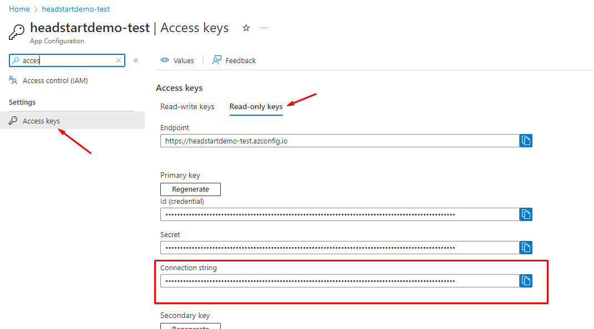
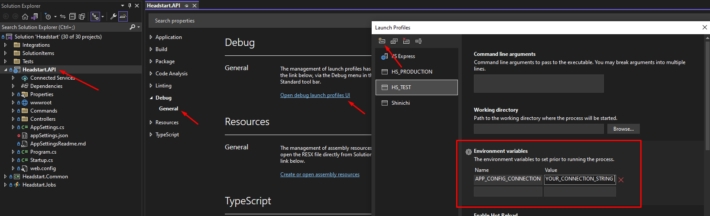
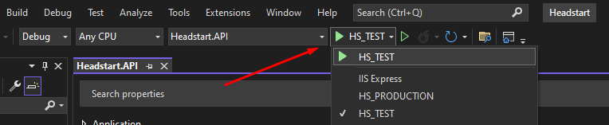

# Azure App Configuration

## Overview
[Azure App Configuration](https://docs.microsoft.com/en-us/azure/azure-app-configuration/overview) is an Azure service that is used for storing sensitive settings. We like it because every member on your team can reference the same app settings. No more copy/pasting app settings trying to stay up to date with changes that someone else made. Although, spoiler alert, it is still possible to use an appSettings.json file if you really want to (more details below)

## Importing Headstart Settings

1. Download <a id="raw-url" href="https://raw.githubusercontent.com/ordercloud-api/headstart/development/assets/templates/AppSettingConfigTemplate.json" download>this template</a>, which includes all of the settings used in Headstart. More detail on what each setting means is available [here](./src/Middleware/src/Headstart.API/AppSettingsReadme.md)
2. Navigate to your Azure App Configuration on Azure
3. Search for Import/export (left navbar)
4. Under "Source Service" click "Configuration File"
5. Under language click "Other"
6. Search for your json file
7. Click "Apply" 
8. Now if you navigate to your Configuration explorer you should see all of the imported settings

## Retrieving the connection string
1. Navigate to your Azure App Configuration on Azure
2. Search for "Access Keys" (left navbar)
3. Click on "Read-only keys"
    - We're not performing any write operations so its more secure to just use the readonly keys
4. Copy the primary key "Connection String"
5. Read the following section for information on how to configure the connection string in Headstart

## Configuring Headstart

In order for you application to consume the settings, you'll need to define the environment variable `APP_CONFIG_CONNECTION` whose value should be the connection string (read-only) to your azure app configuration. Please see ["Retrieving the connection string"](#retrieving-the-connection-string) if needed

### Local Development
1. Open the Headstart Solution in Visual Studio
2. Right click the Headstart.API project
3. Go to "Properties"
4. Under Debug/General click on "Open debug launch profiles UI"
5. Create a new launch profile of type "Project"
6. Scroll down to "Environment Variables" and define the variable with the name `APP_CONFIG_CONNECTION` and the value with your azure app configuration connection string

After doing this you will be able to select your launch profile from the dropdown to start your project

> Note: It is also possible to consume app settings from a JSON file while developing locally. Simply add an `appSettings.json` file to the root of the Headstart.API project. Settings defined here are applied after and *override* any settings in the azure app configuration.

### Hosted Apps

1. Navigate to your middleware app service on Azure
2. Search for "Configuration" (left navbar)
3. Click on "New application setting"
4. Define the variable with the name `APP_CONFIG_CONNECTION` and the value with your azure app configuration connection string

