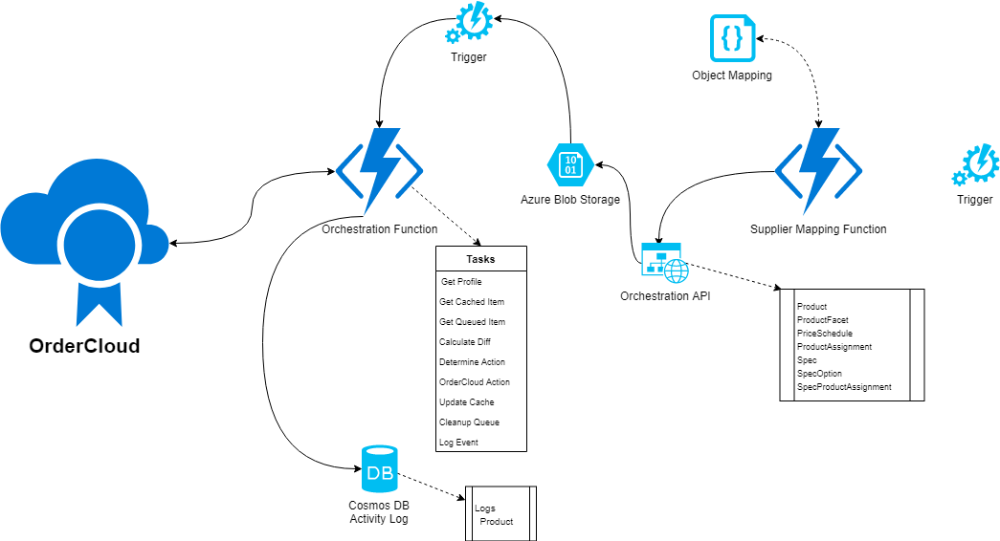

# Product Orchestration

The goal of Product Orchestration is to facilitate the synchronization of remote Product data between remote systems and OrderCloud. Often live integrations aren't possible with systems that do not contain open APIs or the mechanisms to trigger events that report changes. Generally, product data is provided through static APIs or even simply exported flat files. In those instances logic to control the mapping of the data and good stewardship of the OrderCloud platform are required. Product Orchestration is designed to provide the methods to perform these functions.

# General Workflow

Sources are consumed through an Azure function and individual records are mapped to a defined data model referred to as Orchestration<Model>.cs. These records are run through smart logic to determine what event is necessary to sync the record to OrderCloud only when necessary.

## Models and API

Access to the Orchestration is provided through POST methods by object type. Upon hitting the endpoint the record is validated and temporarily stored in an Azure Blob for processing. The Orchestration models are not direct replicas of the OrderCloud definitions. These models are constructed to support the Headstart application and take advantage of the OrderCloud xp functionality.

Currently the API is available at: https://mktp-orchestration.azurewebsites.net/

## Orchestration Workflow

 1. Record Receipt:	The API has validated and dropped the record in the designated Azure Blob and triggered a workflow action.
 2. Get Integration Profile: A profile containing the OrderCloud CientID and ClientSecret are retrieved by the ID provided to the API through the Token used for authentication.
 3. Get Cached Record: An attempt to retrieve the current cached record is performed.
 4. Get Queued Record: The record that triggered the function is retrieved from the Queue blob
 5. Calculate Diff: Both records, if they exist, are compared by a differential algorithm. An object representing the difference is returned.
 6. Determine Action: Based on the results of the comparison and the presence of a cached record the action to perform on OrderCloud is determined. The possible actions are: Ignore, Get, Update or Patch. Updates are ONLY performed when the difference exposes the removal of XP properties.
 7. Refresh Cache: An optional function performed when the logic determines there was no change in the cached record an the new record posted. The is performed as an attempt to keep the orchestration cache up to date with potential changes to the OrderCloud record.
 8. Order Cloud Action: An optional function that performed the activity needed in the OrderCloud platform.
 9. Update Cache: A write operation of the resultant record from either Step 7 or 8 to the Orchestration cache blob.
 10.Log Event: A log of the records, cache and current, the action taken and the result from OrderCloud is recorded in a Cosmos DB for reporting. 
 